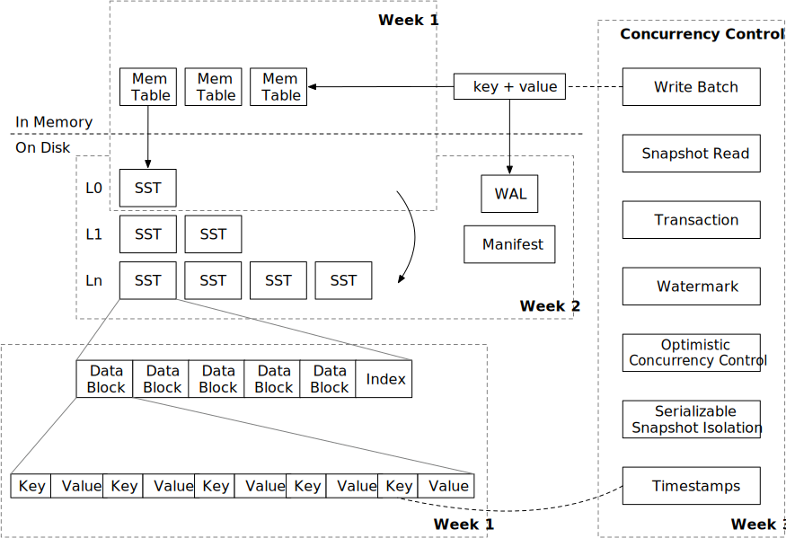
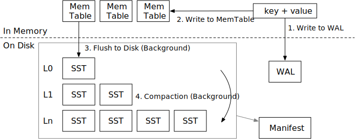
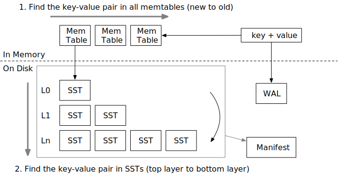

<!--
  mini-lsm-book © 2022-2025 by Alex Chi Z is licensed under CC BY-NC-SA 4.0
-->

# Mini-LSM 课程概述

## 课程结构

本课程分为三个部分（周）。在第一周，我们将专注于 LSM 存储引擎的存储结构和存储格式。在第二周，我们将深入探讨合并操作并为存储引擎实现持久化支持。在第三周，我们将实现多版本并发控制。

* [第一周: Mini-LSM](./week1-overview.md)
* [第二周: 合并和持久化](./week2-overview.md)
* [第三周: 多版本并发控制](./week3-overview.md)

请查看[环境设置](./00-get-started.md)来设置环境。

## LSM 概述

一个 LSM 存储引擎通常包含三个部分：

1. 预写日志，用于持久化临时数据以便恢复。
2. 磁盘上的 SST，用于维护 LSM 树结构。
3. 内存中的内存表，用于批量处理小写入。

存储引擎通常提供以下接口：

* `Put(key, value)`: 在 LSM 树中存储一个键值对。
* `Delete(key)`: 删除一个键及其对应的值。
* `Get(key)`: 获取与键对应的值。
* `Scan(range)`: 获取一个范围内的键值对。

为了确保持久性，

* `Sync()`: 确保在 `sync` 之前的所有操作都持久化到磁盘。

一些引擎选择将 `Put` 和 `Delete` 合并为一个名为 `WriteBatch` 的操作，它接受一批键值对。

在本课程中，我们假设 LSM 树使用层级合并算法，这在现实世界的系统中很常见。

### 写入路径

LSM 的写入路径包含四个步骤：

1. 将键值对写入预写日志，以便在存储引擎崩溃后可以恢复。
2. 将键值对写入内存表。在完成 (1) 和 (2) 后，我们可以通知用户写入操作已完成。
3. （在后台）当内存表已满时，我们会将它们冻结为不可变内存表，并在后台将它们刷新到磁盘作为 SST 文件。
4. （在后台）引擎会将某些层级中的一些文件合并到较低的层级，以保持 LSM 树的良好形状，从而降低读放大。

### 读取路径

当我们想要读取一个键时，

1. 我们将首先从最新到最旧地探测所有内存表。
2. 如果未找到该键，我们将搜索包含 SST 的整个 LSM 树以查找数据。

有两种类型的读取：查找和扫描。查找在 LSM 树中查找一个键，而扫描则遍历存储引擎中某个范围内的所有键。我们将在整个课程中涵盖这两种类型。

{{#include copyright.md}}