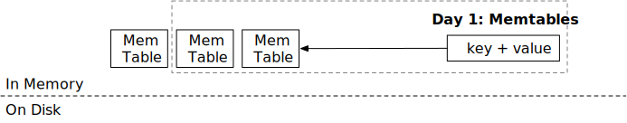
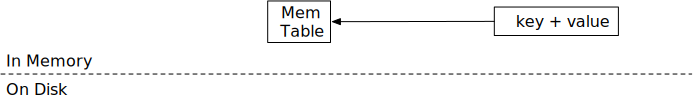
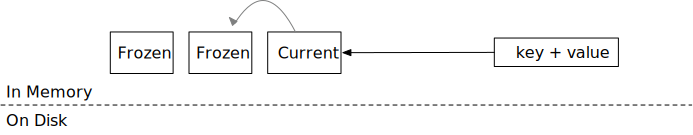

<!--
  mini-lsm-book © 2022-2025 by Alex Chi Z is licensed under CC BY-NC-SA 4.0
-->

# Memtables



在本章中，你将：

* 基于跳表实现内存表（memtable）。
* 实现冻结内存表的逻辑。
* 为内存表实现 LSM 读取路径 `get`。

要将测试用例复制到起始代码并运行它们：

```
cargo x copy-test --week 1 --day 1
cargo x scheck
```

## 任务 1：跳表内存表

在此任务中，你需要修改：

```
src/mem_table.rs
```

首先，让我们实现 LSM 存储引擎的内存结构——内存表。我们选择 [crossbeam 的跳表实现](https://docs.rs/crossbeam-skiplist/latest/crossbeam_skiplist/) 作为内存表的数据结构，因为它支持无锁并发读写。我们不会深入探讨跳表的工作原理，简单来说，它是一个有序的键值映射，易于并发读写。

crossbeam-skiplist 提供了类似于 Rust 标准库 `BTreeMap` 的接口：insert、get 和 iter。唯一的区别是修改接口（即 `insert`）只需要对跳表的不可变引用，而不是可变引用。因此，在你的实现中，实现内存表结构时不应获取任何互斥锁。

你还会注意到 `MemTable` 结构没有 `delete` 接口。在 mini-lsm 实现中，删除操作表示为键对应一个空值。

在此任务中，你需要实现 `MemTable::get` 和 `MemTable::put` 以启用内存表的修改。注意，`put` 应该始终覆盖已存在的键。单个内存表中不会有多个相同键的条目。

我们使用 `bytes` 箱来存储内存表中的数据。`bytes::Byte` 类似于 `Arc<[u8]>`。当你克隆 `Bytes` 或获取 `Bytes` 的切片时，底层数据不会被复制，因此克隆是廉价的。相反，它只是创建对存储区域的新引用，当没有对该区域的引用时，存储区域将被释放。

## 任务 2：引擎中的单个内存表

在此任务中，你需要修改：

```
src/lsm_storage.rs
```

现在，我们将第一个数据结构——内存表，添加到 LSM 状态中。在 `LsmStorageState::create` 中，你会发现当创建 LSM 结构时，我们将初始化一个 id 为 0 的内存表。这是初始状态中的**可变内存表**。在任何时间点，引擎将只有一个可变内存表。内存表通常有大小限制（例如 256MB），当达到大小限制时，它将被冻结为不可变内存表。

查看 `lsm_storage.rs`，你会发现有两个结构表示存储引擎：`MiniLSM` 和 `LsmStorageInner`。`MiniLSM` 是 `LsmStorageInner` 的薄包装。你将在 `LsmStorageInner` 中实现大部分功能，直到第 2 周的压缩。

`LsmStorageState` 存储 LSM 存储引擎的当前结构。目前，我们只使用 `memtable` 字段，它存储当前的可变内存表。在此任务中，你需要实现 `LsmStorageInner::get`、`LsmStorageInner::put` 和 `LsmStorageInner::delete`。它们都应该直接将请求分派到当前内存表。



你的 `delete` 实现应该简单地为该键放入一个空切片，我们称之为*删除墓碑*。你的 `get` 实现应相应地处理这种情况。

要访问内存表，你需要获取 `state` 锁。由于我们的内存表实现只需要 `put` 的不可变引用，你只需要获取 `state` 的读锁就可以修改内存表。这允许多个线程并发访问内存表。

## 任务 3：写入路径 - 冻结内存表

在此任务中，你需要修改：

```
src/lsm_storage.rs
src/mem_table.rs
```



内存表不能无限增长，当达到大小限制时，我们需要冻结它们（稍后刷新到磁盘）。你可以在 `LsmStorageOptions` 中找到内存表大小限制，它**等于 SST 大小限制**（不是 `num_memtables_limit`）。这不是硬限制，你应该尽最大努力冻结内存表。

在此任务中，你需要在内存表中 put/delete 键时计算近似内存表大小。这可以通过简单地将调用 `put` 时键和值的总字节数相加来计算。如果一个键被放入两次，尽管跳表只包含最新的值，你可以在近似内存表大小中计算两次。一旦内存表达到限制，你应该调用 `force_freeze_memtable` 来冻结内存表并创建一个新的。

`LsmStorageInner` 中的 `state: Arc<RwLock<Arc<LsmStorageState>>>` 字段以这种方式结构化，以使用写时复制（CoW）策略并发且安全地管理 LSM 树的整体状态：

1. 内部 `Arc<LsmStorageState>`：这保存了实际 `LsmStorageState`（包含内存表列表、SST 引用等）的**不可变快照**。克隆这个 `Arc` 非常廉价（只是一个原子引用计数递增），并为任何读者在其操作期间提供一致的、不变的状态视图。

2. `RwLock<Arc<LsmStorageState>>`：这个读写锁保护指向当前 `Arc<LsmStorageState>`（活动快照）的*指针*。
    * **读者**获取读锁，克隆 `Arc<LsmStorageState>`（获取对当前快照的自己的引用），然后快速释放读锁。然后他们可以在没有进一步锁定的情况下处理他们的快照。
    * **写者**（当修改状态时，例如冻结内存表）将：
        * 创建一个*新的* `LsmStorageState` 实例，通常通过克隆当前快照的数据然后应用修改。
        * 将这个新状态包装在一个新的 `Arc<LsmStorageState>` 中。
        * 获取 `RwLock` 上的写锁。
        * 用新的替换旧的 `Arc<LsmStorageState>`。
        * 释放写锁。

3. 外部 `Arc<RwLock<...>>`：这允许 `RwLock` 本身（以及访问和更新状态的机制）在可能需要与 `LsmStorageInner` 交互的多个线程或应用程序部分之间安全共享。

这种 CoW 方法确保读者始终看到有效、一致的状态快照，并经历最小的阻塞。写者通过交换整个状态快照来原子地更新状态，减少了持有关键锁的时间，从而提高了并发性。

因为可能有多个线程将数据放入存储引擎，`force_freeze_memtable` 可能从多个线程并发调用。你需要考虑在这种情况下如何避免竞态条件。

有多个地方你可能想要修改 LSM 状态：冻结可变内存表、将内存表刷新到 SST，以及 GC/压缩。在所有这些修改期间，可能有 I/O 操作。结构化锁定策略的直观方式是：

```rust,no_run
fn freeze_memtable(&self) {
    let state = self.state.write();
    state.immutable_memtable.push(/* something */);
    state.memtable = MemTable::create();
}
```

...你在 LSM 状态的写锁中修改所有内容。

这目前工作正常。然而，考虑你想要为创建的每个内存表创建预写日志文件的情况。

```rust,no_run
fn freeze_memtable(&self) {
    let state = self.state.write();
    state.immutable_memtable.push(/* something */);
    state.memtable = MemTable::create_with_wal()?; // <- 可能需要几毫秒
}
```

现在当我们冻结内存表时，其他线程几毫秒内都无法访问 LSM 状态，这会产生延迟峰值。

为了解决这个问题，我们可以将 I/O 操作放在锁区域之外。

```rust,no_run
fn freeze_memtable(&self) {
    let memtable = MemTable::create_with_wal()?; // <- 可能需要几毫秒
    {
        let state = self.state.write();
        state.immutable_memtable.push(/* something */);
        state.memtable = memtable;
    }
}
```

然后，我们在状态写锁区域内没有昂贵的操作。现在，考虑内存表即将达到容量限制的情况，两个线程成功地将两个键放入内存表，它们都在放入两个键后发现内存表达到容量限制。它们都会对内存表进行大小检查并决定冻结它。在这种情况下，我们可能会创建一个空的内存表，然后立即被冻结。

为了解决这个问题，所有状态修改都应该通过状态锁同步。

```rust,no_run
fn put(&self, key: &[u8], value: &[u8]) {
    // 将内容放入内存表，检查容量，并释放 LSM 状态的读锁
    if memtable_reaches_capacity_on_put {
        let state_lock = self.state_lock.lock();
        if /* 再次检查当前内存表达到容量 */ {
            self.freeze_memtable(&state_lock)?;
        }
    }
}
```

你将在未来的章节中经常看到这种模式。例如，对于 L0 刷新：

```rust,no_run
fn force_flush_next_imm_memtable(&self) {
    let state_lock = self.state_lock.lock();
    // 获取最旧的内存表并释放 LSM 状态的读锁
    // 将内容写入磁盘
    // 获取 LSM 状态的写锁并更新状态
}
```

这确保只有一个线程能够修改 LSM 状态，同时仍然允许对 LSM 存储的并发访问。

在此任务中，你需要修改 `put` 和 `delete` 以尊重内存表的软容量限制。当达到限制时，调用 `force_freeze_memtable` 来冻结内存表。注意，我们没有针对这种并发场景的测试用例，你需要自己考虑所有可能的竞态条件。此外，记得检查锁区域以确保关键部分是最小必需的。

你可以简单地将下一个内存表 id 分配为 `self.next_sst_id()`。注意，`imm_memtables` 从最新的内存表到最早的内存表存储内存表。也就是说，`imm_memtables.first()` 应该是最后冻结的内存表。

## 任务 4：读取路径 - Get

在此任务中，你需要修改：

```
src/lsm_storage.rs
```

现在你有了多个内存表，你可以修改读取路径 `get` 函数以获取键的最新版本。确保你从最新的内存表到最早的内存表探测内存表。

## 测试你的理解

* 为什么内存表不提供 `delete` API？
* 内存表存储所有写操作而不是仅存储键的最新版本是否有意义？例如，用户将 a->1、a->2 和 a->3 放入同一个内存表。
* 是否可以使用其他数据结构作为 LSM 中的内存表？使用跳表的优缺点是什么？
* 为什么我们需要 `state` 和 `state_lock` 的组合？我们能否只使用 `state.read()` 和 `state.write()`？
* 存储和探测内存表的顺序为什么重要？如果一个键出现在多个内存表中，你应该向用户返回哪个版本？
* 内存表的内存布局是否高效/是否具有良好的数据局部性？（思考 `Byte` 是如何实现并存储在跳表中的...）有哪些可能的优化可以使内存表更高效？
* 我们在这个课程中使用 `parking_lot` 锁。它的读写锁是公平锁吗？如果有一个写者等待现有读者停止，尝试获取锁的读者可能会发生什么？
* 冻结内存表后，是否可能某些线程仍然持有旧的 LSM 状态并写入这些不可变内存表？你的解决方案如何防止这种情况发生？
* 有几个地方你可能首先获取状态的读锁，然后释放它并获取写锁（这两个操作可能在不同的函数中，但由于一个函数调用另一个而顺序发生）。这与直接将读锁升级为写锁有何不同？是否有必要升级而不是获取和释放，升级的成本是什么？

我们不提供问题的参考答案，欢迎在 Discord 社区中讨论它们。

## 额外任务

* **更多内存表格式。** 你可以实现其他内存表格式。例如，BTree 内存表、向量内存表和 ART 内存表。

{{#include copyright.md}}