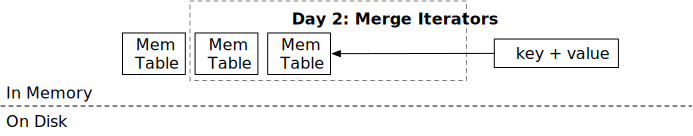

<!--
  mini-lsm-book © 2022-2025 by Alex Chi Z is licensed under CC BY-NC-SA 4.0
-->

# 合并迭代器



在本章中，你将：

* 实现内存表迭代器。
* 实现合并迭代器。
* 为内存表实现 LSM 读取路径 `scan`。

要将测试用例复制到起始代码并运行它们：

```
cargo x copy-test --week 1 --day 2
cargo x scheck
```

## 任务 1：内存表迭代器

在本章中，我们将实现 LSM `scan` 接口。`scan` 使用迭代器 API 按顺序返回一系列键值对。在上一章中，你已经实现了 `get` API 和创建不可变内存表的逻辑，你的 LSM 状态现在应该有多个内存表。你需要首先在单个内存表上创建迭代器，然后在所有内存表上创建合并迭代器，最后为迭代器实现范围限制。

在此任务中，你需要修改：

```
src/mem_table.rs
```

所有 LSM 迭代器都实现 `StorageIterator` trait。它有 4 个函数：`key`、`value`、`next` 和 `is_valid`。如果你熟悉 Rust 标准库的 `Iterator` trait，你可能会发现 `StorageIterator` 有点不同。相反，`StorageIterator` 采用基于游标的 API，这是数据库系统中常见的设计模式，尤其受到 RocksDB 迭代器的启发（参见 [`iterator_base.h`](https://github.com/facebook/rocksdb/blob/main/include/rocksdb/iterator_base.h) 和 [`iterator.h`](https://github.com/facebook/rocksdb/blob/main/include/rocksdb/iterator.h) 作为参考）。

当迭代器创建时，它的游标会停在某个元素上，`key` / `value` 将返回内存表/块/SST 中满足起始条件（即起始键）的第一个键。这两个接口将返回一个 `&[u8]` 以避免复制。

从调用者的角度来看，典型的使用模式是：

```rust
let mut iter: impl StorageIterator = ...;
while iter.is_valid() {
    let key = iter.key();
    let value = iter.value();
    // 处理键和值
    iter.next()?; // 前进到下一个项目，处理潜在错误
}
```

`StorageIterator` 的核心方法语义不同：

* `next()`：此方法仅负责尝试将游标移动到下一个元素。它返回一个 `Result` 来报告在此前进过程中遇到的任何错误（例如 I/O 问题）。它*不*固有地保证新位置有效，只保证尝试移动。
* `is_valid()`：此方法指示迭代器的当前游标是否指向有效的数据元素。它*不*推进迭代器。

因此，作为 `StorageIterator` 的实现者，在每次调用 `next()` 之后（即使它成功且 `next()` 操作本身没有错误），你有责任更新内部状态，以便 `is_valid()` 正确反映新游标位置是否实际指向有效项目。

总之，`next` 将游标移动到下一个位置。`is_valid` 返回迭代器是否已到达末尾或出错。你可以假设 `next` 只会在 `is_valid` 返回 true 时被调用。将有一个 `FusedIterator` 包装器，用于在迭代器无效时阻止对 `next` 的调用，以避免用户误用迭代器。

回到内存表迭代器。你应该已经发现迭代器没有任何与之关联的生命周期。想象一下，你创建一个 `Vec<u64>` 并调用 `vec.iter()`，迭代器类型将类似于 `VecIterator<'a>`，其中 `'a` 是 `vec` 对象的生命周期。这同样适用于 `SkipMap`，其 `iter` API 返回一个带有生命周期的迭代器。然而，在我们的情况下，我们不希望迭代器上有这样的生命周期，以避免使系统过于复杂（并且难以编译...）。

如果迭代器没有生命周期泛型参数，我们应该确保*每当使用迭代器时，底层跳表对象不会被释放*。实现这一点的唯一方法是将 `Arc<SkipMap>` 对象放入迭代器本身。要定义这样的结构：

```rust,no_run
pub struct MemtableIterator {
    map: Arc<SkipMap<Bytes, Bytes>>,
    iter: SkipMapRangeIter<'???>,
}
```

好的，这里有问题：我们想表达迭代器的生命周期与结构中的 `map` 相同。我们该怎么做？

这是你在这个课程中遇到的第一个也是最棘手的 Rust 语言问题——自引用结构。如果可以写这样的东西：

```rust,no_run
pub struct MemtableIterator { // <- 带有生命周期 'this
    map: Arc<SkipMap<Bytes, Bytes>>,
    iter: SkipMapRangeIter<'this>,
}
```

那么问题就解决了！你可以借助一些第三方库如 `ouroboros` 来实现。它提供了一种定义自引用结构的简单方法。也可以使用不安全的 Rust 来实现（实际上，`ouroboros` 本身在内部使用不安全的 Rust...）

我们已利用 [`ouroboros`](https://docs.rs/ouroboros/latest/ouroboros/attr.self_referencing.html) 为你定义了自引用的 `MemtableIterator` 字段。你需要基于这个提供的结构实现 `MemtableIterator` 逻辑和 `Memtable::scan` API。

## 任务 2：合并迭代器

在此任务中，你需要修改：

```
src/iterators/merge_iterator.rs
```

现在你有了多个内存表，你将创建多个内存表迭代器。你需要合并来自内存表的结果，并将每个键的最新版本返回给用户。

`MergeIterator` 在内部维护一个二叉堆。考虑将 `n` 个有序序列（我们的迭代器）合并为单个有序输出的挑战；二叉堆在这里很自然，因为它有效地帮助识别哪个序列当前持有整体最小的元素。你会看到二叉堆的排序方式是，具有最低头部键值的迭代器排在前面。当多个迭代器具有相同的头部键值时，最新的迭代器排在前面。注意，你需要处理错误（即当迭代器无效时），并确保键值对的最新版本出现。

例如，如果我们有以下数据：

```
iter1: b->del, c->4, d->5
iter2: a->1, b->2, c->3
iter3: e->4
```

合并迭代器输出的序列应该是：

```
a->1, b->del, c->4, d->5, e->4
```

合并迭代器的构造函数接受一个迭代器向量。我们假设索引较低的迭代器（即第一个）具有最新的数据。

使用 Rust 二叉堆时，你可能会发现 `peek_mut` 函数很有用。

```rust,no_run
let Some(mut inner) = heap.peek_mut() {
    *inner += 1; // <- 对内部项目进行一些修改
}
// 当 PeekMut 引用被丢弃时，二叉堆会自动重新排序。

let Some(mut inner) = heap.peek_mut() {
    PeekMut::pop(inner) // <- 从堆中弹出它
}
```

一个常见的陷阱是错误处理。例如：

```rust,no_run
let Some(mut inner_iter) = self.iters.peek_mut() {
    inner_iter.next()?; // <- 会导致问题
}
```

如果 `next` 返回错误（即由于磁盘故障、网络故障、校验和错误等），它就不再有效。然而，当我们退出 if 条件并将错误返回给调用者时，`PeekMut` 的 drop 将尝试在堆内移动元素，这会导致访问无效的迭代器。因此，你需要自己处理所有错误，而不是在 `PeekMut` 的作用域内使用 `?`。

我们想尽可能避免动态分发，因此我们在系统中不使用 `Box<dyn StorageIterator>`。相反，我们更喜欢使用泛型进行静态分发。还要注意 `StorageIterator` 使用泛型关联类型（GAT），因此它可以同时支持 `KeySlice` 和 `&[u8]` 作为键类型。我们将在第 3 周将时间戳添加到 `KeySlice` 中，现在使用单独的类型可以使过渡更平滑。

从本节开始，我们将使用 `Key<T>` 来表示 LSM 键类型，并在类型系统中将它们与值区分开来。你应该使用 `Key<T>` 提供的 API，而不是直接访问内部值。我们将在第 3 部分向此键类型添加时间戳，使用键抽象将使过渡更平滑。目前，`KeySlice` 等同于 `&[u8]`，`KeyVec` 等同于 `Vec<u8>`，`KeyBytes` 等同于 `Bytes`。

## 任务 3：LSM 迭代器 + 融合迭代器

在此任务中，你需要修改：

```
src/lsm_iterator.rs
```

我们使用 `LsmIterator` 结构来表示内部 LSM 迭代器。在整个课程中，当更多迭代器添加到系统中时，你将需要多次修改此结构。目前，因为我们只有多个内存表，它应该定义为：

```rust,no_run
type LsmIteratorInner = MergeIterator<MemTableIterator>;
```

你可以继续实现 `LsmIterator` 结构，它调用相应的内部迭代器，并跳过已删除的键。

我们在此任务中不测试 `LsmIterator`。任务 4 中将有一个集成测试。

然后，我们希望在迭代器上提供额外的安全性，以避免用户误用它们。当迭代器无效时，用户不应调用 `key`、`value` 或 `next`。同时，如果 `next` 返回错误，他们不应再使用迭代器。`FusedIterator` 是迭代器的包装器，用于规范化所有迭代器的行为。你可以继续自己实现它。

## 任务 4：读取路径 - Scan

在此任务中，你需要修改：

```
src/lsm_storage.rs
```

我们终于到了——使用你实现的所有迭代器，你终于可以实现 LSM 引擎的 `scan` 接口了。你可以简单地用内存表迭代器构造一个 LSM 迭代器（记得将最新的内存表放在合并迭代器的前面），你的存储引擎将能够处理扫描请求。

## 测试你的理解

* 使用你的合并迭代器的时间/空间复杂度是多少？
* 为什么我们需要自引用结构用于内存表迭代器？
* 如果一个键被删除（有一个删除墓碑），你需要将其返回给用户吗？你在哪里处理了这个逻辑？
* 如果一个键有多个版本，用户会看到所有版本吗？你在哪里处理了这个逻辑？
* 如果我们想摆脱自引用结构并在内存表迭代器上有一个生命周期（即 `MemtableIterator<'a>`，其中 `'a` = 内存表或 `LsmStorageInner` 生命周期），是否仍然可以实现 `scan` 功能？
* 如果（1）我们在跳表内存表上创建一个迭代器（2）有人向内存表中插入新键（3）迭代器会看到新键吗？
* 如果你的键比较器不能给二叉堆实现提供稳定的顺序会发生什么？
* 为什么我们需要确保合并迭代器按迭代器构造顺序返回数据？
* 是否可以为 LSM 迭代器实现 Rust 风格的迭代器（即 `next(&self) -> (Key, Value)`）？优缺点是什么？
* scan 接口类似于 `fn scan(&self, lower: Bound<&[u8]>, upper: Bound<&[u8]>)`。如何使此 API 与 Rust 风格的范围（即 `key_a..key_b`）兼容？如果你实现了这个，尝试将完整范围 `..` 传递给接口，看看会发生什么。
* 起始代码提供了合并迭代器接口来存储 `Box<I>` 而不是 `I`。这背后的原因可能是什么？

我们不提供问题的参考答案，欢迎在 Discord 社区中讨论它们。

## 额外任务

* **前台迭代器。** 在本课程中，我们假设所有操作都很短，因此我们可以在迭代器中持有对内存表的引用。如果用户长时间持有迭代器，整个内存表（可能为 256MB）将保留在内存中，即使它已被刷新到磁盘。为了解决这个问题，我们可以向用户提供 `ForegroundIterator` / `LongIterator`。迭代器将定期创建新的底层存储迭代器，以便允许资源的垃圾回收。

{{#include copyright.md}}