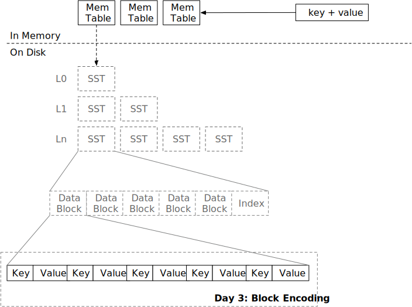

<!--
  mini-lsm-book © 2022-2025 by Alex Chi Z is licensed under CC BY-NC-SA 4.0
-->

# 块



在本章中，你将：

* 实现 SST 块编码。
* 实现 SST 块解码和块迭代器。

要将测试用例复制到起始代码并运行它们：

```
cargo x copy-test --week 1 --day 3
cargo x scheck
```

## 任务 1：块构建器

在前两章中，你已经实现了 LSM 存储引擎的所有内存结构。现在是时候构建磁盘结构了。磁盘结构的基本单位是块。块通常为 4-KB 大小（大小可能因存储介质而异），这相当于操作系统中的页面大小和 SSD 上的页面大小。块存储有序的键值对。SST 由多个块组成。当内存表数量超过系统限制时，它将把内存表刷新为 SST。在本章中，你将实现块的编码和解码。

在此任务中，你需要修改：

```
src/block/builder.rs
src/block.rs
```

我们课程中的块编码格式如下：

```plaintext
----------------------------------------------------------------------------------------------------
|             Data Section             |              Offset Section             |      Extra      |
----------------------------------------------------------------------------------------------------
| Entry #1 | Entry #2 | ... | Entry #N | Offset #1 | Offset #2 | ... | Offset #N | num_of_elements |
----------------------------------------------------------------------------------------------------
```

每个条目是一个键值对。

```plaintext
-----------------------------------------------------------------------
|                           Entry #1                            | ... |
-----------------------------------------------------------------------
| key_len (2B) | key (keylen) | value_len (2B) | value (varlen) | ... |
-----------------------------------------------------------------------
```

键长度和值长度都是 2 字节，这意味着它们的最大长度为 65535。（内部存储为 `u16`）

我们假设键永远不会为空，值可以为空。空值意味着在系统其他部分的视图中，相应的键已被删除。对于 `BlockBuilder` 和 `BlockIterator`，我们只是按原样处理空值。

在每个块的末尾，我们将存储每个条目的偏移量和条目总数。例如，如果第一个条目位于块的第 0 个位置，第二个条目位于块的第 12 个位置。

```
------------------------------
|offset|offset|num_of_elements|
------------------------------
|   0  |  12  |       2       |
------------------------------
```

块的页脚将如上所示。每个数字都存储为 `u16`。

块有一个大小限制，即 `target_size`。除非第一个键值对超过目标块大小，否则你应该确保编码后的块大小始终小于或等于 `target_size`。（在提供的代码中，这里的 `target_size` 本质上是 `block_size`）

当调用 `build` 时，`BlockBuilder` 将生成数据部分和未编码的条目偏移量。这些信息将存储在 `Block` 结构中。由于键值条目以原始格式存储，偏移量存储在单独的向量中，这减少了解码数据时不必要的内存分配和处理开销——你需要做的只是将原始块数据复制到 `data` 向量中，并每 2 字节解码条目偏移量，*而不是*创建类似 `Vec<(Vec<u8>, Vec<u8>)>` 的东西来在内存中存储一个块中的所有键值对。这种紧凑的内存布局非常高效。

在 `Block::encode` 和 `Block::decode` 中，你需要按照上述格式编码/解码块。

## 任务 2：块迭代器

在此任务中，你需要修改：

```
src/block/iterator.rs
```

现在我们有了编码的块，我们需要实现 `BlockIterator` 接口，以便用户可以查找/扫描块中的键。

`BlockIterator` 可以用 `Arc<Block>` 创建。如果调用 `create_and_seek_to_first`，它将被定位在块中的第一个键。如果调用 `create_and_seek_to_key`，迭代器将被定位在第一个 `>=` 提供的键的键。例如，如果 `1, 3, 5` 在一个块中。

```rust,no_run
let mut iter = BlockIterator::create_and_seek_to_key(block, b"2");
assert_eq!(iter.key(), b"3");
```

上面的 `seek 2` 将使迭代器定位在 `2` 的下一个可用键，在这种情况下是 `3`。

迭代器应该从块中复制 `key` 并将其存储在迭代器内部（未来我们将有键压缩，你将不得不这样做）。对于值，你应该只存储迭代器中的开始/结束偏移量，而不复制它们。

当调用 `next` 时，迭代器将移动到下一个位置。如果我们到达块的末尾，我们可以将 `key` 设置为空并从 `is_valid` 返回 `false`，以便调用者可以在可能的情况下切换到另一个块。

## 测试你的理解

* 在块中查找键的时间复杂度是多少？
* 在你的实现中，当你查找一个不存在的键时，游标停在哪里？
* 所以 `Block` 只是原始数据的向量和偏移量的向量。我们能否将它们更改为 `Byte` 和 `Arc<[u16]>`，并将所有迭代器接口更改为返回 `Byte` 而不是 `&[u8]`？（假设我们使用 `Byte::slice` 返回块的切片而不复制。）优缺点是什么？
* 在你的实现中，写入块中的数字的字节序是什么？
* 你的实现是否容易受到恶意构建的块的影响？如果用户故意构造一个无效的块，是否会有无效的内存访问或 OOM？
* 一个块可以包含重复的键吗？
* 如果用户添加一个大于目标块大小的键会发生什么？
* 考虑 LSM 引擎构建在对象存储服务（S3）上的情况。你将如何优化/更改块格式和参数以使其适合此类服务？
* 你喜欢珍珠奶茶吗？为什么喜欢或不喜欢？

我们不提供问题的参考答案，欢迎在 Discord 社区中讨论它们。

## 额外任务

* **反向迭代器。** 你可以为你的 `BlockIterator` 实现 `prev`，以便你能够反向迭代键值对。你也可以有反向合并迭代器和反向 SST 迭代器（在下一章中）的变体，以便你的存储引擎可以进行反向扫描。

{{#include copyright.md}}