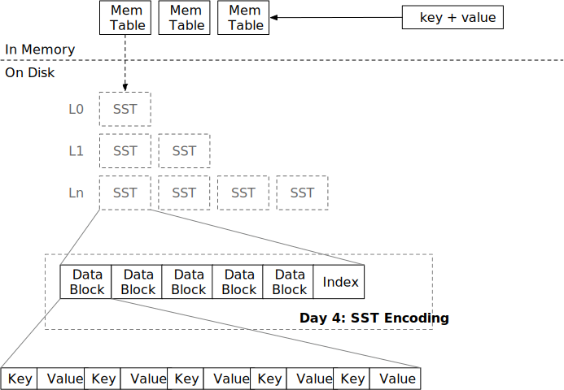

<!--
  mini-lsm-book © 2022-2025 by Alex Chi Z is licensed under CC BY-NC-SA 4.0
-->

# 排序字符串表（SST）



在本章中，你将：

* 实现 SST 编码和元数据编码。
* 实现 SST 解码和迭代器。

要将测试用例复制到起始代码并运行它们：

```
cargo x copy-test --week 1 --day 4
cargo x scheck
```

## 任务 1：SST 构建器

在此任务中，你需要修改：

```
src/table/builder.rs
src/table.rs
```

SST 由存储在磁盘上的数据块和索引块组成。通常，数据块是延迟加载的——直到用户请求时才会加载到内存中。索引块也可以按需加载，但在本课程中，我们做出简单假设，即所有 SST 索引块（元块）都可以放入内存（实际上我们没有专门的索引块实现）。通常，SST 文件大小为 256MB。

SST 构建器类似于块构建器——用户将在构建器上调用 `add`。你应该在 SST 构建器内部维护一个 `BlockBuilder`，并在必要时拆分块。此外，你还需要维护块元数据 `BlockMeta`，其中包括每个块中的第一个/最后一个键以及每个块的偏移量。`build` 函数将编码 SST，使用 `FileObject::create` 将所有内容写入磁盘，并返回一个 `SsTable` 对象。

SST 的编码如下：

```plaintext
-------------------------------------------------------------------------------------------
|         Block Section         |          Meta Section         |          Extra          |
-------------------------------------------------------------------------------------------
| data block | ... | data block |            metadata           | meta block offset (u32) |
-------------------------------------------------------------------------------------------
```

你还需要实现 `SsTableBuilder` 的 `estimated_size` 函数，以便调用者知道何时可以开始新的 SST 来写入数据。该函数不需要非常准确。鉴于数据块包含的数据比元块多得多，我们可以简单地返回数据块的大小作为 `estimated_size`。

除了 SST 构建器，你还需要完成块元数据的编码/解码，以便 `SsTableBuilder::build` 可以生成有效的 SST 文件。

## 任务 2：SST 迭代器

在此任务中，你需要修改：

```
src/table/iterator.rs
src/table.rs
```

与 `BlockIterator` 类似，你需要在 SST 上实现一个迭代器。注意，你应该按需加载数据。例如，如果你的迭代器在块 1 处，它不应该在内存中持有任何其他块内容，直到它到达下一个块。

`SsTableIterator` 应该实现 `StorageIterator` trait，以便将来可以与其他迭代器组合。

需要注意的一点是 `seek_to_key` 函数。基本上，你需要在块元数据上进行二分查找，以找到可能包含该键的块。该键可能不存在于 LSM 树中，因此块迭代器在查找后可能立即无效。例如：

```plaintext
--------------------------------------
| block 1 | block 2 |   block meta   |
--------------------------------------
| a, b, c | e, f, g | 1: a/c, 2: e/g |
--------------------------------------
```

我们建议仅使用每个块的第一个键进行二分查找，以减少实现的复杂性。如果我们在该 SST 中执行 `seek(b)`，这很简单——使用二分查找，我们可以知道块 1 包含键 `a <= keys < e`。因此，我们加载块 1 并将块迭代器查找到相应位置。

但是如果我们执行 `seek(d)`，我们将定位到块 1，如果我们只使用第一个键作为二分查找标准，但在块 1 中查找 `d` 将到达块的末尾。因此，我们应该在查找后检查迭代器是否无效，并在必要时切换到下一个块。或者你可以利用最后一个键元数据直接定位到正确的块，这取决于你。

## 任务 3：块缓存

在此任务中，你需要修改：

```
src/table/iterator.rs
src/table.rs
```

你可以在 `SsTable` 上实现一个新的 `read_block_cached` 函数。

我们使用 [`moka-rs`](https://docs.rs/moka/latest/moka/) 作为我们的块缓存实现。块以 `(sst_id, block_id)` 作为缓存键进行缓存。你可以使用 `try_get_with` 从缓存中获取块（如果缓存命中）/填充缓存（如果缓存未命中）。如果有多个请求读取同一个块且缓存未命中，`try_get_with` 将只向磁盘发出单个读取请求，并将结果广播给所有请求。

此时，你可以将表迭代器更改为使用 `read_block_cached` 而不是 `read_block`，以利用块缓存。

## 测试你的理解

* 在 SST 中查找键的时间复杂度是多少？
* 在你的实现中，当你查找一个不存在的键时，游标停在哪里？
* 是否可能（或必要）对 SST 文件进行原地更新？
* SST 通常很大（例如 256MB）。在这种情况下，复制/扩展 `Vec` 的成本将很高。你的实现是否为 SST 构建器预先分配了足够的空间？你是如何实现的？
* 查看 `moka` 块缓存，为什么它返回 `Arc<Error>` 而不是原始的 `Error`？
* 使用块缓存是否保证内存中最多有固定数量的块？例如，如果你有一个 4GB 的 `moka` 块缓存和 4KB 的块大小，内存中是否会有超过 4GB/4KB 数量的块同时存在？
* 是否可以在 LSM 引擎中存储列式数据（即 100 个整数列的表）？当前的 SST 格式仍然是一个好的选择吗？
* 考虑 LSM 引擎构建在对象存储服务（即 S3）上的情况。你将如何优化/更改 SST 格式/参数和块缓存以使其适合此类服务？
* 目前，我们将所有 SST 的索引加载到内存中。假设你为索引保留了 16GB 内存，你能估计你的 LSM 系统可以支持的数据库的最大大小吗？（这就是为什么你需要索引缓存！）

我们不提供问题的参考答案，欢迎在 Discord 社区中讨论它们。

## 额外任务

* **探索不同的 SST 编码和布局。** 例如，在 [Lethe: Enabling Efficient Deletes in LSMs](https://disc-projects.bu.edu/lethe/) 论文中，作者向 SST 添加了辅助键支持。
  * 或者你可以使用 B+ 树作为 SST 格式，而不是排序块。
* **索引块。** 将块索引和块元数据拆分为索引块，并按需加载它们。
* **索引缓存。** 为索引使用单独的缓存，与数据块缓存分开。
* **I/O 优化。** 将块对齐到 4KB 边界，并使用直接 I/O 绕过系统页面缓存。

{{#include copyright.md}}