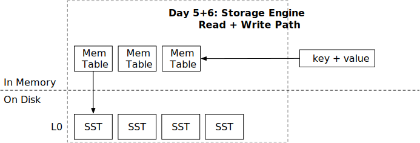

<!--
  mini-lsm-book © 2022-2025 by Alex Chi Z is licensed under CC BY-NC-SA 4.0
-->

# 读取路径



在本章中，你将：

* 将 SST 集成到 LSM 读取路径中。
* 使用 SST 实现 LSM 读取路径 `get`。
* 使用 SST 实现 LSM 读取路径 `scan`。

要将测试用例复制到起始代码并运行它们：

```
cargo x copy-test --week 1 --day 5
cargo x scheck
```

## 任务 1：双合并迭代器

在此任务中，你需要修改：

```
src/iterators/two_merge_iterator.rs
```

你已经实现了一个合并迭代器，用于合并相同类型的迭代器（即内存表迭代器）。现在我们已经实现了 SST 格式，我们既有磁盘上的 SST 结构，也有内存中的内存表。当我们从存储引擎扫描时，我们需要将来自内存表迭代器和 SST 迭代器的数据合并为一个。在这种情况下，我们需要一个 `TwoMergeIterator<X, Y>` 来合并两种不同类型的迭代器。

你可以在 `two_merge_iterator.rs` 中实现 `TwoMergeIterator`。由于我们这里只有两个迭代器，我们不需要维护二叉堆。相反，我们可以简单地使用一个标志来指示读取哪个迭代器。与 `MergeIterator` 类似，如果在两个迭代器中都找到相同的键，第一个迭代器优先。

## 任务 2：读取路径 - Scan

在此任务中，你需要修改：

```
src/lsm_iterator.rs
src/lsm_storage.rs
```

实现 `TwoMergeIterator` 后，我们可以将 `LsmIteratorInner` 更改为以下类型：

```rust,no_run
type LsmIteratorInner =
    TwoMergeIterator<MergeIterator<MemTableIterator>, MergeIterator<SsTableIterator>>;
```

这样我们的 LSM 存储引擎的内部迭代器将是一个结合了内存表和 SST 数据的迭代器。

目前，我们的 SST 迭代器不支持扫描的结束边界。为了解决这个问题，你需要在 `LsmIterator` 本身内实现此边界检查。这涉及更新 `LsmIterator::new` 构造函数以接受 `end_bound` 参数：

```rust,no_run
pub(crate) fn new(iter: LsmIteratorInner, end_bound: Bound<Bytes>) -> Result<Self> {}
```

然后你需要修改 `LsmIterator` 的迭代逻辑，以确保当内部迭代器的键达到或超过指定的 `end_bound` 时停止。

我们的测试用例将在 `l0_sstables` 中生成一些内存表和 SST，你需要在此任务中正确扫描所有这些数据。你不需要刷新 SST，直到下一章。因此，你可以继续修改你的 `LsmStorageInner::scan` 接口，以在所有内存表和 SST 上创建合并迭代器，从而完成存储引擎的读取路径。

因为 `SsTableIterator::create` 涉及 I/O 操作并且可能很慢，我们不希望在 `state` 关键部分中执行此操作。因此，你应该首先读取 `state` 并克隆 LSM 状态快照的 `Arc`。然后，你应该释放锁。之后，你可以遍历所有 L0 SST 并为每个 SST 创建迭代器，然后创建一个合并迭代器来检索数据。

```rust,no_run
fn scan(&self) {
    let snapshot = {
        let guard = self.state.read();
        Arc::clone(&guard)
    };
    // 创建迭代器并查找它们
}
```

在 LSM 存储状态中，我们只在 `l0_sstables` 向量中存储 SST id。你需要从 `sstables` 哈希映射中检索实际的 SST 对象。

## 任务 3：读取路径 - Get

在此任务中，你需要修改：

```
src/lsm_storage.rs
```

对于 get 请求，它将在内存表中进行查找，然后在 SST 上进行扫描。你可以在探测所有内存表后，在所有 SST 上创建合并迭代器。你可以查找到用户想要查找的键。查找有两种可能性：键与用户探测的相同，以及键不相同/不存在。只有当键存在且与探测的键相同时，你才应将值返回给用户。你还应该像上一节一样减少状态锁的关键部分。还要记得处理已删除的键。

## 测试你的理解

* 考虑用户有一个迭代器迭代整个存储引擎的情况，存储引擎大小为 1TB，因此扫描所有数据需要约 1 小时。如果用户这样做会有什么问题？（这是一个好问题，我们将在课程的不同时间点多次询问它...）
* 一些 LSM 树存储引擎提供的另一个流行接口是多获取（或向量化获取）。用户可以传递他们想要检索的键列表。接口返回每个键的值。例如，`multi_get(vec!["a", "b", "c", "d"]) -> a=1,b=2,c=3,d=4`。显然，一个简单的实现是简单地对每个键执行单个 get。你将如何实现多获取接口，以及你可以进行哪些优化以使其更高效？（提示：get 过程中的某些操作只需要对所有键执行一次，除此之外，你可以考虑改进的磁盘 I/O 接口以更好地支持此多获取接口）。

我们不提供问题的参考答案，欢迎在 Discord 社区中讨论它们。

## 额外任务

* **动态分发的成本。** 实现合并迭代器的 `Box<dyn StorageIterator>` 版本，并进行基准测试以查看性能差异。
* **并行查找。** 创建合并迭代器需要加载所有底层 SST 的第一个块（当你创建 `SSTIterator` 时）。你可以并行化创建迭代器的过程。

{{#include copyright.md}}