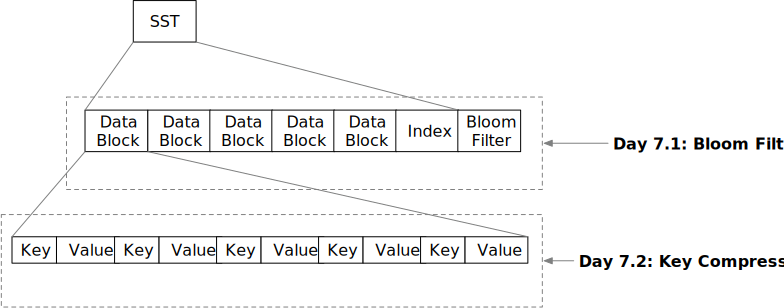

<!--
  mini-lsm-book © 2022-2025 by Alex Chi Z is licensed under CC BY-NC-SA 4.0
-->

# 零食时间：SST 优化



在上一章中，你已经构建了一个支持 get/scan/put 的存储引擎。在本周结束时，我们将实现一些简单但重要的 SST 格式优化。欢迎来到 Mini-LSM 第 1 周的零食时间！

在本章中，你将：

* 在 SST 上实现布隆过滤器并集成到 LSM 读取路径 `get` 中。
* 在 SST 块格式中实现键压缩。

要将测试用例复制到起始代码并运行它们：

```
cargo x copy-test --week 1 --day 7
cargo x scheck
```

## 任务 1：布隆过滤器

布隆过滤器是维护一组键的概率数据结构。你可以向布隆过滤器添加键，并且你可以知道添加到布隆过滤器中的键集中哪些键可能存在/一定不存在。

你通常需要一个哈希函数来构建布隆过滤器，一个键可以有多个哈希值。让我们看下面的例子。假设我们已经有一些键的哈希值，并且布隆过滤器有 7 位。

[注意：如果你想更好地理解布隆过滤器，请查看[这里](https://samwho.dev/bloom-filters/)]

```plaintext 
hash1 = ((character - a) * 13) % 7
hash2 = ((character - a) * 11) % 7
b -> 6 4
c -> 5 1
d -> 4 5
e -> 3 2
g -> 1 3
h -> 0 0
```

如果我们插入 b, c, d 到 7 位布隆过滤器中，我们将得到：

```
    bit  0123456
insert b     1 1
insert c  1   1
insert d     11
result   0101111
```

当探测布隆过滤器时，我们为键生成哈希值，并查看相应的位是否已设置。如果所有位都设置为 true，则该键可能存在于布隆过滤器中。否则，该键一定不存在于布隆过滤器中。

对于 `e -> 3 2`，由于位 2 未设置，它不应在原始集合中。对于 `g -> 1 3`，因为两个位都已设置，它可能存在或不存在于集合中。对于 `h -> 0 0`，两个位（实际上是一个位）都未设置，因此它不应在原始集合中。

```
b -> 可能（实际：是）
c -> 可能（实际：是）
d -> 可能（实际：是）
e -> 一定不（实际：否）
g -> 可能（实际：否）
h -> 一定不（实际：否）
```

记住在上一章结束时，我们基于键范围实现了 SST 过滤。现在，在 `get` 读取路径上，我们也可以使用布隆过滤器来忽略不包含用户想要查找的键的 SST，从而减少需要从磁盘读取的文件数量。

在此任务中，你需要修改：

```
src/table/bloom.rs
```

在实现中，你将从键哈希（u32 数字）构建布隆过滤器。对于每个哈希，你需要设置 `k` 位。位通过以下方式计算：

```rust,no_run
let delta = (h >> 17) | (h << 15); // h 是键哈希
for _ in 0..k {
    // TODO: 使用哈希设置相应的位
    h = h.wrapping_add(delta);
}
```

我们提供了所有用于神奇数学的骨架代码。你只需要实现构建布隆过滤器和探测布隆过滤器的过程。

## 任务 2：在读取路径上集成布隆过滤器

在此任务中，你需要修改：

```
src/table/builder.rs
src/table.rs
src/lsm_storage.rs
```

对于布隆过滤器编码，你可以将布隆过滤器附加到 SST 文件的末尾。你需要在文件末尾存储布隆过滤器偏移量，并相应地计算元偏移量。

```plaintext
-----------------------------------------------------------------------------------------------------
|         Block Section         |                            Meta Section                           |
-----------------------------------------------------------------------------------------------------
| data block | ... | data block | metadata | meta block offset | bloom filter | bloom filter offset |
|                               |  varlen  |         u32       |    varlen    |        u32          |
-----------------------------------------------------------------------------------------------------
```

我们使用 `farmhash` 箱来计算键的哈希值。构建 SST 时，你还需要通过使用 `farmhash::fingerprint32` 计算键哈希来构建布隆过滤器。你需要使用块元编码/解码布隆过滤器。你可以为布隆过滤器选择 0.01 的误报率。除了起始代码中提供的字段外，你可能需要根据需要向结构添加新字段。

之后，你可以修改 `get` 读取路径以基于布隆过滤器过滤 SST。

我们没有此部分的集成测试，你需要确保你的实现仍然通过所有先前章节的测试。

## 任务 3：键前缀编码 + 解码

在此任务中，你需要修改：

```
src/block/builder.rs
src/block/iterator.rs
```

由于 SST 文件按顺序存储键，用户可能存储相同前缀的键，我们可以在 SST 编码中压缩前缀以节省空间。

我们将当前键与块中的第一个键进行比较。我们按如下方式存储键：

```
key_overlap_len (u16) | rest_key_len (u16) | key (rest_key_len)
```

`key_overlap_len` 表示与块中第一个键相同的字节数。例如，如果我们看到一个记录：`5|3|LSM`，其中块中的第一个键是 `mini-something`，我们可以将当前键恢复为 `mini-LSM`。

完成编码后，你还需要在块迭代器中实现解码。除了起始代码中提供的字段外，你可能需要根据需要向结构添加新字段。

## 测试你的理解

* 布隆过滤器如何帮助 SST 过滤过程？它可以告诉你关于键的什么信息？（可能不存在/可能存在/一定存在/一定不存在）
* 考虑我们需要反向迭代器的情况。我们的键压缩是否影响反向迭代器？
* 你可以在扫描上使用布隆过滤器吗？
* 与块中的第一个键相比，对相邻键进行键前缀编码的优缺点可能是什么？

我们不提供问题的参考答案，欢迎在 Discord 社区中讨论它们。

{{#include copyright.md}}