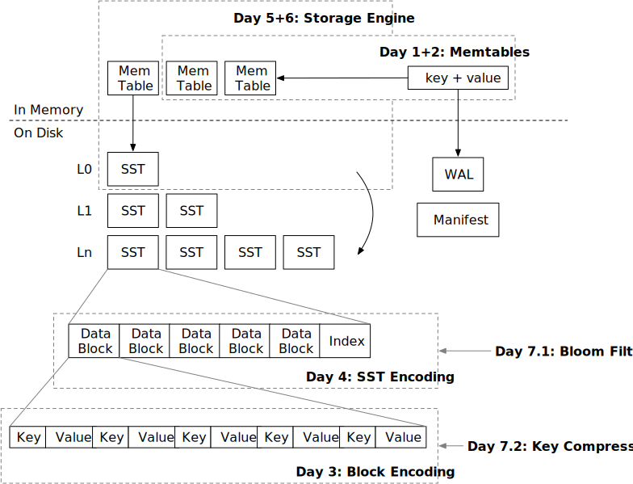

<!--
  mini-lsm-book © 2022-2025 by Alex Chi Z is licensed under CC BY-NC-SA 4.0
-->

# 第一周概述: Mini-LSM

在课程的第一周，你将构建存储引擎的必要存储格式、系统的读取路径和写入路径，并拥有一个基于 LSM 的键值存储的工作实现。这部分有 7 章（天）。

* [第 1 天: 内存表](./week1-01-memtable.md)。你将实现系统的内存读取和写入路径。
* [第 2 天: 合并迭代器](./week1-02-merge-iterator.md)。你将扩展第 1 天构建的内容，并为你的系统实现一个 `scan` 接口。
* [第 3 天: 块编码](./week1-03-block.md)。现在我们开始磁盘结构的第一步，构建块的编码/解码。
* [第 4 天: SST 编码](./week1-04-sst.md)。SST 由块组成，在这一天结束时，你将拥有 LSM 磁盘结构的基本构建块。
* [第 5 天: 读取路径](./week1-05-read-path.md)。既然我们有了内存和磁盘结构，我们可以将它们组合在一起，为存储引擎提供一个完全工作的读取路径。
* [第 6 天: 写入路径](./week1-06-write-path.md)。在第 5 天，测试框架生成结构，而在第 6 天，你将自行控制 SST 刷新。你将实现刷新到 level-0 SST，存储引擎就完成了。
* [第 7 天: SST 优化](./week1-07-sst-optimizations.md)。我们将实现几种 SST 格式优化，并提高系统的性能。

在这一周结束时，你的存储引擎应该能够处理所有 get/scan/put 请求。唯一缺失的部分是将 LSM 状态持久化到磁盘，以及一种更有效的方式来组织磁盘上的 SST。你将拥有一个可工作的 **Mini-LSM** 存储引擎。

{{#include copyright.md}}