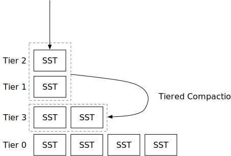

<!--
  mini-lsm-book © 2022-2025 by Alex Chi Z is licensed under CC BY-NC-SA 4.0
-->

# 分层压缩策略



在本章中，你将：

* 实现分层压缩策略并在压缩模拟器上进行模拟。
* 将分层压缩策略整合到系统中。

我们在本章讨论的分层压缩与 RocksDB 的通用压缩相同。我们将交替使用这两个术语。

要将测试用例复制到起始代码并运行它们：

```
cargo x copy-test --week 2 --day 3
cargo x scheck
```

<div class="warning">

在阅读本章之前，查看[第 2 周概述](./week2-overview.md)可能有助于对压缩有一个总体了解。

</div>

## 任务 1：通用压缩

在本章中，你将实现 RocksDB 的通用压缩，它属于分层压缩策略家族。类似于简单分级压缩策略，我们在此压缩策略中仅使用文件数作为指标。当我们触发压缩作业时，我们总是包含一个完整的排序运行（层）在压缩作业中。

### 任务 1.0：前提条件

在此任务中，你需要修改：

```
src/compact/tiered.rs
```

在通用压缩中，我们不使用 LSM 状态中的 L0 SST。相反，我们直接将新的 SST 刷新到一个排序运行（称为层）。在 LSM 状态中，`levels` 现在将包含所有层，其中**最低索引是最新刷新的 SST**。`levels` 向量中的每个元素存储一个元组：级别 ID（用作层 ID）和该级别中的 SST。每次刷新 L0 SST 时，你应该将 SST 刷新到向量前面的一个层中。压缩模拟器基于第一个 SST id 生成层 id，你应该在实现中做同样的事情。

通用压缩只会在层数（排序运行）达到 `num_tiers` 时触发任务。否则，它不会触发任何压缩。

### 任务 1.1：由空间放大比率触发

通用压缩的第一个触发器是空间放大比率。正如我们在概述章节中讨论的，空间放大可以通过 `engine_size / last_level_size` 来估计。在我们的实现中，我们通过 `除最后一级外的所有级别大小 / 最后一级大小` 来计算空间放大比率，以便比率可以缩放到 `[0, +∞)` 而不是 `[1, +∞]`。这也与 RocksDB 实现一致。

我们这样计算空间放大比率的原因是因为我们以这样的方式建模引擎：它存储固定数量的用户数据（即假设为 100GB），并且用户通过写入引擎不断更新值。因此，最终，所有键都被推送到最底层，最底层的大小应该等同于数据量（100GB），上层包含尚未压缩到最底层的数据更新。

当 `除最后一级外的所有级别大小 / 最后一级大小` >= `max_size_amplification_percent * 1%` 时，我们需要触发完全压缩。例如，如果我们有一个 LSM 状态如下：

```
层 3: 1
层 2: 1 ; 除最后一级外的所有级别大小 = 2
层 1: 1 ; 最后一级大小 = 1, 2/1=2
```

假设 `max_size_amplification_percent` = 200，我们现在应该触发完全压缩。

实现此触发器后，你可以运行压缩模拟器。你将看到：

```shell
cargo run --bin compaction-simulator tiered --iterations 10
```

```
=== 迭代 2 ===
--- 刷新后 ---
L3 (1): [3]
L2 (1): [2]
L1 (1): [1]
--- 压缩任务 ---
压缩由空间放大比率触发: 200
L3 [3] L2 [2] L1 [1] -> [4, 5, 6]
--- 压缩后 ---
L4 (3): [3, 2, 1]
```

使用此触发器，我们只会在达到空间放大比率时触发完全压缩。在模拟结束时，你将看到：

```bash
cargo run --bin compaction-simulator tiered
```

```
=== 迭代 7 ===
--- 刷新后 ---
L8 (1): [8]
L7 (1): [7]
L6 (1): [6]
L5 (1): [5]
L4 (1): [4]
L3 (1): [3]
L2 (1): [2]
L1 (1): [1]
--- 压缩任务 ---
--- 压缩任务 ---
压缩由空间放大比率触发: 700
L8 [8] L7 [7] L6 [6] L5 [5] L4 [4] L3 [3] L2 [2] L1 [1] -> [9, 10, 11, 12, 13, 14, 15, 16]
--- 压缩后 ---
L9 (8): [8, 7, 6, 5, 4, 3, 2, 1]
--- 压缩任务 ---
此迭代中触发 1 次压缩
--- 统计 ---
写放大: 16/8=2.000x
最大空间使用: 16/8=2.000x
读放大: 1x
压缩模拟器中的 `num_tiers` 设置为 8。然而，LSM 状态中的层数远超过 8，这导致较大的读放大。

当前触发器仅减少空间放大。我们需要向压缩算法添加新触发器以减少读放大。

### 任务 1.2：由大小比率触发

下一个触发器是大小比率触发器。该触发器维护层之间的大小比率。从第一层开始，我们计算 `此层大小 / 所有先前层的总和`。对于第一个遇到的值 `> (100 + size_ratio) * 1%` 的层，我们将压缩除当前层外的所有先前层。我们只在有超过 `min_merge_width` 个层要合并时才进行此压缩。

例如，给定以下 LSM 状态，并假设 `size_ratio` = 1，`min_merge_width` = 2。当比率值 > 101% 时，我们应该压缩：

```
层 3: 1
层 2: 1 ; 1 / 1 = 1
层 1: 1 ; 1 / (1 + 1) = 0.5, 未触发压缩
```

示例 2：

```
层 3: 1
层 2: 1 ; 1 / 1 = 1
层 1: 3 ; 3 / (1 + 1) = 1.5, 压缩层 2+3
```

```
层 4: 2
层 1: 3
```

示例 3：

```
层 3: 1
层 2: 2 ; 2 / 1 = 2, 然而，仅压缩一个层没有意义；还要注意 min_merge_width=2
层 1: 4 ; 4 / 3 = 1.33, 压缩层 2+3
```

```
层 4: 3
层 1: 4
```

使用此触发器，你将在压缩模拟器中观察到以下情况：

```bash
cargo run --bin compaction-simulator tiered
```

```
=== 迭代 49 ===
--- 刷新后 ---
L119 (1): [119]
L118 (1): [118]
L114 (4): [113, 112, 111, 110]
L105 (5): [104, 103, 102, 101, 100]
L94 (6): [93, 92, 91, 90, 89, 88]
L81 (7): [80, 79, 78, 77, 76, 75, 74]
L48 (26): [47, 46, 45, 44, 43, 37, 38, 39, 40, 41, 42, 24, 25, 26, 27, 28, 29, 30, 9, 10, 11, 12, 13, 14, 15, 16]
--- 压缩任务 ---
--- 压缩任务 ---
未触发压缩
--- 统计 ---
写放大: 119/50=2.380x
最大空间使用: 52/50=1.040x
读放大: 7x
```

将会有更少的 1-SST 层，压缩算法将通过大小比率维护层具有从小到大的大小。然而，当 LSM 状态中有更多 SST 时，仍然会有我们拥有超过 `num_tiers` 个层的情况。为了限制层数，我们需要另一个触发器。

### 任务 1.3：减少排序运行

如果之前的触发器都没有产生压缩任务，我们将进行主要压缩，将前 `max_merge_tiers` 个层的 SST 文件合并为一个层，以减少层数。

启用此压缩触发器后，你将看到：

```bash
cargo run --bin compaction-simulator-ref tiered --iterations 200 --size-only
```

```
=== 迭代 199 ===
--- 刷新后 ---
级别: 0 1 1 4 5 21 28 140
未触发压缩
--- 统计 ---
写放大: 742/200=3.710x
最大空间使用: 280/200=1.400x
读放大: 7x
```

**注意：我们没有为此部分提供细粒度的单元测试。你可以运行压缩模拟器并与参考解决方案的输出进行比较，以查看你的实现是否正确。**

## 任务 2：与读取路径集成

在此任务中，你需要修改：

```
src/compact.rs
src/lsm_storage.rs
```

由于分层压缩不使用 LSM 状态的 L0 级别，你应该直接将内存表刷新到新层，而不是作为 L0 SST。你可以使用 `self.compaction_controller.flush_to_l0()` 来知道是否刷新到 L0。你可以使用第一个输出 SST id 作为新排序运行的级别/层 id。你还需要修改压缩过程以为分层压缩作业构建合并迭代器。

## 相关阅读

[通用压缩 - RocksDB Wiki](https://github.com/facebook/rocksdb/wiki/Universal-Compaction)

## 测试你的理解

* 层级压缩的估计写放大是多少？（好吧，这很难估计...但如果没有最后的*减少排序运行*触发器呢？）
* 层级压缩的估计读放大是多少？
* 与简单分级/分层压缩相比，通用压缩的优缺点是什么？
* 运行通用压缩需要多少存储空间（与用户数据大小相比）？
* 如果两个层在 LSM 状态中不相邻，我们可以合并它们吗？
* 如果压缩速度跟不上分层压缩的 SST 刷新会发生什么？
* 如果系统并行调度多个压缩任务，可能需要考虑什么？
* SSD 也写入自己的日志（基本上它是一个日志结构存储）。如果 SSD 的写放大为 2 倍，整个系统的端到端写放大是多少？相关：[ZNS: Avoiding the Block Interface Tax for Flash-based SSDs](https://www.usenix.org/conference/atc21/presentation/bjorling)。
* 考虑用户选择为分层压缩保留大量排序运行（即 300）的情况。为了使读取路径更快，保留一些数据结构来帮助减少在每个层中为某些键范围查找要读取的 SST 的时间复杂度（即到 `O(log n)`）是一个好主意吗？注意，通常，你需要在每个排序运行中进行二分查找以找到需要读取的键范围。（查看 Neon 的[层映射](https://neon.tech/blog/persistent-structures-in-neons-wal-indexing)实现！）

我们不提供问题的参考答案，欢迎在 Discord 社区中讨论它们。

{{#include copyright.md}}