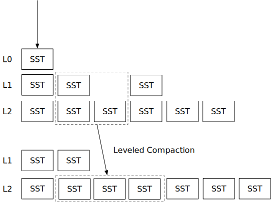

<!--
  mini-lsm-book © 2022-2025 by Alex Chi Z is licensed under CC BY-NC-SA 4.0
-->

# 层级压缩策略



在本章中，你将：

* 实现层级压缩策略并在压缩模拟器上进行模拟。
* 将层级压缩策略整合到系统中。

要将测试用例复制到起始代码并运行它们：

```
cargo x copy-test --week 2 --day 4
cargo x scheck
```

<div class="warning">

在阅读本章之前，查看[第 2 周概述](./week2-overview.md)可能有助于对压缩有一个总体了解。

</div>

## 任务 1：层级压缩

在第 2 周第 2 天，你已经实现了简单的层级压缩策略。然而，该实现存在一些问题：

* 压缩总是包含一个完整的级别。请注意，在完成压缩之前不能移除旧文件，因此，在压缩进行时，你的存储引擎可能会使用 2 倍的存储空间（如果是完全压缩）。分层压缩存在相同的问题。在本章中，我们将实现部分压缩，即我们从上层选择一个 SST 进行压缩，而不是整个级别。
* SST 可能会跨空级别进行压缩。正如你在压缩模拟器中看到的，当 LSM 状态为空，并且引擎刷新一些 L0 SST 时，这些 SST 将首先压缩到 L1，然后从 L1 到 L2，等等。最优策略是直接将 SST 从 L0 放置到尽可能低的级别，以避免不必要的写放大。

在本章中，你将实现一个生产就绪的层级压缩策略。该策略与 RocksDB 的层级压缩相同。你需要修改：

```
src/compact/leveled.rs
```

要运行压缩模拟器：

```
cargo run --bin compaction-simulator leveled
```

### 任务 1.1：计算目标大小

在此压缩策略中，你需要知道每个 SST 的第一个/最后一个键以及 SST 的大小。压缩模拟器将为你设置一些模拟 SST 以供访问。

你需要计算级别的目标大小。假设 `base_level_size_mb` 是 200MB，级别数（除 L0 外）是 6。当 LSM 状态为空时，目标大小将是：

```
[0 0 0 0 0 200MB]
```

在底层超过 `base_level_size_mb` 之前，所有其他中间级别的目标大小都为 0。这个想法是，当数据总量较小时，创建中间级别是浪费的。

当底层达到或超过 `base_level_size_mb` 时，我们将通过从大小除以 `level_size_multiplier` 来计算其他级别的目标大小。假设底层包含 300MB 数据，且 `level_size_multiplier=10`。

```
0 0 0 0 30MB 300MB
```

此外，最多*一个*级别可以在 `base_level_size_mb` 以下具有正的目标大小。假设我们现在在最后一级有 30GB 的文件，目标大小将是：

```
0 0 30MB 300MB 3GB 30GB
```

注意在这种情况下，L1 和 L2 的目标大小为 0，L3 是唯一在 `base_level_size_mb` 以下具有正目标大小的级别。

### 任务 1.2：决定基础级别

现在，让我们解决简单层级压缩策略中 SST 可能跨空级别压缩的问题。当我们压缩 L0 SST 与较低级别时，我们不直接将其放入 L1。相反，我们将其与第一个 `target size > 0` 的级别压缩。例如，当目标级别大小为：

```
0 0 0 0 30MB 300MB
```

如果 L0 SST 的数量达到 `level0_file_num_compaction_trigger` 阈值，我们将压缩 L0 SST 与 L5 SST。

现在，你可以生成 L0 压缩任务并运行压缩模拟器。

```
--- After Flush ---
L0 (1): [23]
L1 (0): []
L2 (0): []
L3 (2): [19, 20]
L4 (6): [11, 12, 7, 8, 9, 10]

...

--- After Flush ---
L0 (2): [102, 103]
L1 (0): []
L2 (0): []
L3 (18): [42, 65, 86, 87, 76, 77, 78, 79, 80, 81, 82, 83, 84, 85, 61, 62, 52, 34]
L4 (6): [11, 12, 7, 8, 9, 10]
```

压缩模拟器中的级别数为 4。因此，SST 应直接刷新到 L3/L4。

### 任务 1.3：决定级别优先级

现在我们需要处理 L0 以下的压缩。L0 压缩始终具有最高优先级，因此如果达到阈值，应首先压缩 L0 与其他级别。之后，我们可以通过 `current_size / target_size` 计算每个级别的压缩优先级。我们只压缩此比率 `> 1.0` 的级别。具有最大比率的级别将被选择与较低级别进行压缩。例如，如果我们有：

```
L3: 200MB, target_size=20MB
L4: 202MB, target_size=200MB
L5: 1.9GB, target_size=2GB
L6: 20GB, target_size=20GB
```

压缩的优先级将是：

```
L3: 200MB/20MB = 10.0
L4: 202MB/200MB = 1.01
L5: 1.9GB/2GB = 0.95
```

L3 和 L4 需要分别与它们的较低级别压缩，而 L5 不需要。L3 具有较大的比率，因此我们将生成 L3 和 L4 的压缩任务。压缩完成后，我们可能会安排 L4 和 L5 的压缩。

### 任务 1.4：选择要压缩的 SST

现在，让我们解决简单层级压缩策略中压缩总是包含一个完整级别的问题。当我们决定压缩两个级别时，我们总是从上层的 SST 中选择最旧的 SST。你可以通过比较 SST id 来知道 SST 产生的时间。

还有其他选择压缩 SST 的方法，例如，通过查看删除标记的数量。你可以将此作为额外任务的一部分实现。

选择上层 SST 后，你需要找到较低级别中与上层 SST 键重叠的所有 SST。然后，你可以生成一个压缩任务，其中恰好包含上层的一个 SST 和较低级别的重叠 SST。

压缩完成后，你需要从状态中移除 SST，并将新的 SST 插入到正确的位置。请注意，除了 L0 外，你应该在所有级别中保持 SST id 按第一个键排序。

运行压缩模拟器，你应该看到：

```
--- After Compaction ---
L0 (0): []
L1 (4): [222, 223, 208, 209]
L2 (5): [206, 196, 207, 212, 165]
L3 (11): [166, 120, 143, 144, 179, 148, 167, 140, 189, 180, 190]
L4 (22): [113, 85, 86, 36, 46, 37, 146, 100, 147, 203, 102, 103, 65, 81, 105, 75, 82, 95, 96, 97, 152, 153]
```

级别的大小应保持在级别乘数比率以下。压缩任务：

```
Upper L1 [224.sst 7cd080e..=33d79d04]
Lower L2 [210.sst 1c657df4..=31a00e1b, 211.sst 31a00e1c..=46da9e43] -> [228.sst 7cd080e..=1cd18f74, 229.sst 1cd18f75..=31d616db, 230.sst 31d616dc..=46da9e43]
```

...应该只包含上层的一个 SST。

**注意：我们没有为此部分提供细粒度的单元测试。你可以运行压缩模拟器并与参考解决方案的输出进行比较，以查看你的实现是否正确。**

## 任务 2：与读取路径集成

在此任务中，你需要修改：

```
src/compact.rs
src/lsm_storage.rs
```

实现应类似于简单层级压缩。记得更改 get/scan 读取路径和压缩迭代器。

## 相关阅读

[层级压缩 - RocksDB Wiki](https://github.com/facebook/rocksdb/wiki/Leveled-Compaction)

## 测试你的理解

* 层级压缩的估计写放大是多少？
* 层级压缩的估计读放大是多少？
* 为压缩找到一个好的键分割点可能会减少写放大，还是完全无关紧要？（考虑用户写入以某些前缀开头的键的情况，`00` 和 `01`。这两个前缀下的键数量不同，它们的写入模式也不同。如果我们总是可以将 `00` 和 `01` 分割到不同的 SST 中...）
* 想象一个用户之前使用分层（通用）压缩，现在想要迁移到层级压缩。这种迁移可能面临什么挑战？如何进行迁移？
* 如果我们反向操作，如果用户想要从层级压缩迁移到分层压缩呢？
* 如果压缩速度跟不上层级压缩的 SST 刷新会发生什么？
* 如果系统并行调度多个压缩任务，可能需要考虑什么？
* 层级压缩的峰值存储使用量是多少？与通用压缩相比呢？
* 较低的 `level_size_multiplier` 是否总是能获得较低的写放大？
* 如果完全不使用压缩的用户决定迁移到层级压缩，需要做什么？
* 有些人建议在将 L0 表推送到较低层之前进行 L0 内部压缩（压缩 L0 表并仍将它们放在 L0 中）。这样做可能有什么好处？（可能相关：[PebblesDB SOSP'17](https://www.cs.utexas.edu/~vijay/papers/sosp17-pebblesdb.pdf)）
* 考虑上层有两个表 `[100, 200], [201, 300]`，下层有 `[50, 150], [151, 250], [251, 350]` 的情况。在这种情况下，你仍然想一次压缩上层的一个文件吗？为什么？

我们不提供问题的参考答案，欢迎在 Discord 社区中讨论它们。

## 额外任务

* **SST 摄取**。LSM 树中数据迁移/批量导入的常见优化是要求上游生成其数据的 SST 文件，并直接将这些文件放置在 LSM 状态中，而不经过写入路径。
* **SST 选择**。除了选择最旧的 SST，你可以考虑其他启发式方法来选择要压缩的 SST。

{{#include copyright.md}}