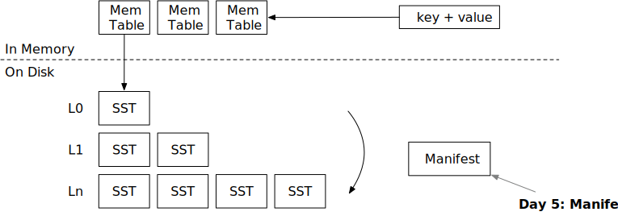

<!--
  mini-lsm-book © 2022-2025 by Alex Chi Z is licensed under CC BY-NC-SA 4.0
-->

# 清单



在本章中，你将：

* 实现清单文件的编码和解码。
* 系统重启时从清单恢复。

要将测试用例复制到起始代码并运行它们：

```
cargo x copy-test --week 2 --day 5
cargo x scheck
```

## 任务 1：清单编码

系统使用清单文件记录引擎中发生的所有操作。目前，只有两种类型：压缩和 SST 刷新。当引擎重启时，它将读取清单文件，重建状态，并加载磁盘上的 SST 文件。

存储 LSM 状态有很多方法。最简单的方法之一是将完整状态存储到 JSON 文件中。每次我们进行压缩或刷新新的 SST 时，我们可以将整个 LSM 状态序列化到文件中。这种方法的问题是，当数据库变得非常大（即 10k SST）时，将清单写入磁盘将非常慢。因此，我们将清单设计为仅追加文件。

在此任务中，你需要修改：

```
src/manifest.rs
```

我们使用 JSON 编码清单记录。你可以使用 `serde_json::to_vec` 将清单记录编码为 json，将其写入清单文件，并进行 fsync。从清单文件读取时，你可以使用 `serde_json::Deserializer::from_slice`，它将返回记录流。你不需要存储记录长度等，因为 `serde_json` 可以自动找到记录的分割。

清单格式如下：

```
| JSON 记录 | JSON 记录 | JSON 记录 | JSON 记录 |
```

再次注意，我们不记录每个记录有多少字节的信息。

引擎运行几个小时后，清单文件可能会变得非常大。那时，你可以定期压缩清单文件以存储当前快照并截断日志。这是你可以作为额外任务的一部分实现的优化。

## 任务 2：写入清单

现在你可以继续修改 LSM 引擎以在必要时写入清单。在此任务中，你需要修改：

```
src/lsm_storage.rs
src/compact.rs
```

目前，我们只使用两种类型的清单记录：SST 刷新和压缩。SST 刷新记录存储刷新到磁盘的 SST id。压缩记录存储压缩任务和产生的 SST id。每次你将一些新文件写入磁盘时，首先同步文件和存储目录，然后写入清单并同步清单。清单文件应写入 `<path>/MANIFEST`。

要同步目录，你可以实现 `sync_dir` 函数，其中可以使用 `File::open(dir).sync_all()?` 来同步它。在 Linux 上，目录是一个包含目录中文件列表的文件。通过对目录进行 fsync，你将确保如果断电，新写入（或移除）的文件对用户可见。

记得为后台压缩触发器（分级/简单/通用）和用户请求进行强制压缩时都写入压缩清单记录。

## 任务 3：关闭时刷新

在此任务中，你需要修改：

```
src/lsm_storage.rs
```

你需要实现 `close` 函数。如果 `self.options.enable_wal = false`（我们将在下一章介绍 WAL），你应该在停止存储引擎之前将所有内存表刷新到磁盘，以便所有用户更改都将被持久化。

## 任务 4：从状态恢复

在此任务中，你需要修改：

```
src/lsm_storage.rs
```

现在，你可以修改 `open` 函数以从清单文件恢复引擎状态。要恢复它，你需要首先生成需要加载的 SST 列表。你可以通过调用 `apply_compaction_result` 并恢复 LSM 状态中的 SST id 来做到这一点。之后，你可以迭代状态并加载所有 SST（更新 sstables 哈希映射）。在此过程中，你需要计算最大 SST id 并更新 `next_sst_id` 字段。之后，你可以使用该 id 创建一个新的内存表，并将 id 递增一。

如果你实现了分级压缩，你可能每次应用压缩结果时都对 SST 进行排序。然而，使用清单恢复，你的排序逻辑将被破坏，因为在恢复过程中，你无法知道每个 SST 的起始键和结束键。为了解决这个问题，你需要读取 `apply_compaction_result` 函数的 `in_recovery` 标志。在恢复过程中，你不应尝试检索 SST 的第一个键。LSM 状态恢复且所有 SST 打开后，你可以在恢复过程结束时进行排序。

可选地，你可以在清单中包含每个 SST 的起始键和结束键。此策略用于 RocksDB/BadgerDB，因此你不需要在压缩应用过程中区分恢复模式和正常模式。

你可以使用 mini-lsm-cli 测试你的实现。

```
cargo run --bin mini-lsm-cli
fill 1000 2000
close
cargo run --bin mini-lsm-cli
get 1500
```

## 测试你的理解

* 你何时需要调用 `fsync`？为什么需要同步目录？
* 你需要在哪些地方写入清单？
* 考虑 LSM 引擎的替代实现，它不使用清单文件。相反，它在每个文件的头部记录级别/层信息，每次重启时扫描存储目录，并仅从目录中存在的文件恢复 LSM 状态。在此实现中是否可能正确维护 LSM 状态，以及这可能有什么问题/挑战？
* 目前，我们在创建合并迭代器之前创建所有 SST/连接迭代器，这意味着我们必须在开始扫描过程之前将所有级别中第一个 SST 的第一个块加载到内存中。我们在清单中有起始/结束键，是否可以利用此信息延迟数据块的加载，并使返回第一个键值对的时间更快？
* 是否可以不将层/级别信息存储在清单中？即，我们只在清单中存储拥有的 SST 列表而不包含级别信息，并使用键范围和时间戳信息（SST 元数据）重建层/级别。

## 额外任务

* **清单压缩。** 当清单文件中的日志数量变得太大时，你可以重写清单文件以仅存储当前快照，并将新日志追加到该文件。
* **并行打开。** 收集要打开的 SST 列表后，你可以并行打开和解码它们，而不是一个一个地做，从而加速恢复过程。

{{#include copyright.md}}