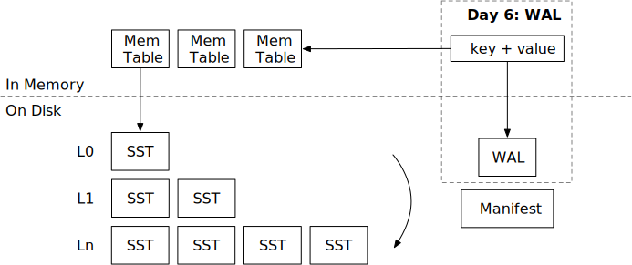

<!--
  mini-lsm-book © 2022-2025 by Alex Chi Z is licensed under CC BY-NC-SA 4.0
-->

# 预写日志（WAL）



在本章中，你将：

* 实现预写日志文件的编码和解码。
* 系统重启时从 WAL 恢复内存表。

要将测试用例复制到起始代码并运行它们：

```
cargo x copy-test --week 2 --day 6
cargo x scheck
```

## 任务 1：WAL 编码

在此任务中，你需要修改：

```
src/wal.rs
```

在上一章中，我们已经实现了清单文件，以便 LSM 状态可以被持久化。并且我们实现了 `close` 函数以在停止引擎之前将所有内存表刷新到 SST。现在，如果系统崩溃（即断电）怎么办？我们可以将内存表修改记录到 WAL（预写日志），并在重启数据库时恢复 WAL。WAL 仅在 `self.options.enable_wal = true` 时启用。

WAL 编码简单来说就是键值对列表。

```
| key_len | key | value_len | value |
```

你还需要实现 `recover` 函数以读取 WAL 并恢复内存表的状态。

注意，我们使用 `BufWriter` 来写入 WAL。使用 `BufWriter` 可以减少进入操作系统的系统调用次数，从而减少写入路径的延迟。当用户修改键时，不保证数据已写入磁盘。相反，引擎只保证在调用 `sync` 时数据被持久化。为了正确地将数据持久化到磁盘，你需要首先通过调用 `flush()` 将数据从缓冲写入器刷新到文件对象，然后使用 `get_mut().sync_all()` 对文件进行 fsync。注意，你*只*需要在引擎的 `sync` 被调用时进行 fsync。你*不需要*每次写入数据时都进行 fsync。

## 任务 2：集成 WAL

在此任务中，你需要修改：

```
src/mem_table.rs
src/wal.rs
src/lsm_storage.rs
```

`MemTable` 有一个 WAL 字段。如果 `wal` 字段设置为 `Some(wal)`，你需要在更新内存表时追加到 WAL。在你的 LSM 引擎中，如果 `enable_wal = true`，你需要创建 WAL。你还需要在创建新内存表时使用 `ManifestRecord::NewMemtable` 记录更新清单。

你可以使用 `create_with_wal` 函数创建带有 WAL 的内存表。WAL 应写入存储目录中的 `<memtable_id>.wal`。如果此内存表作为 L0 SST 刷新，内存表 id 应与 SST id 相同。

## 任务 3：从 WAL 恢复

在此任务中，你需要修改：

```
src/lsm_storage.rs
```

如果启用了 WAL，你需要在加载数据库时基于 WAL 恢复内存表。你还需要实现数据库的 `sync` 函数。`sync` 的基本保证是引擎确定数据已持久化到磁盘（并在重启时将恢复）。为了实现这一点，你可以简单地同步与当前内存表对应的 WAL。

```
cargo run --bin mini-lsm-cli -- --enable-wal
```

记得从状态恢复正确的 `next_sst_id`，应该是 `max{内存表 id, sst id}` + 1。在你的 `close` 函数中，如果 `enable_wal` 设置为 true，你不应将内存表刷新到 SST，因为 WAL 本身提供持久性。你应该等待所有压缩和刷新线程退出后再关闭数据库。

## 测试你的理解

* 你应该何时在引擎中调用 `fsync`？如果你调用 `fsync` 太频繁（即每次 put 键请求）会发生什么？
* 在 SSD（固态硬盘）上，`fsync` 操作通常有多昂贵？
* 你何时可以告诉用户他们的修改（put/delete）已被持久化？
* 如何处理 WAL 中的损坏数据？
* 是否可能设计一个没有 WAL 的 LSM 引擎（即使用 L0 作为 WAL）？这种设计会有什么影响？

我们不提供问题的参考答案，欢迎在 Discord 社区中讨论它们。

{{#include copyright.md}}