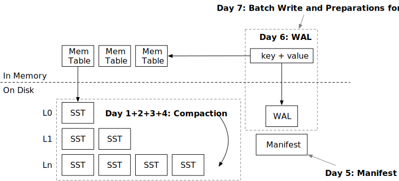

<!--
  mini-lsm-book © 2022-2025 by Alex Chi Z is licensed under CC BY-NC-SA 4.0
-->

# 第 2 周概述：压缩和持久化



在上周，你已经实现了 LSM 存储引擎的所有必要结构，你的存储引擎已经支持读写接口。在本周，我们将深入探讨 SST 文件的磁盘组织，并研究在系统中实现性能和成本效率的最佳方式。我们将花 4 天时间学习不同的压缩策略，从最简单到最复杂的，然后实现存储引擎持久化的剩余部分。在本周结束时，你将拥有一个功能齐全且高效的 LSM 存储引擎。

本部分有 7 章（天）：

* [第 1 天：压缩实现](./week2-01-compaction.md)。你将把所有 L0 SST 合并为一个排序运行。
* [第 2 天：简单分级压缩](./week2-02-simple.md)。你将实现经典的分级压缩算法，并使用压缩模拟器查看其效果。
* [第 3 天：分层/通用压缩](./week2-03-tiered.md)。你将实现 RocksDB 通用压缩算法并理解其优缺点。
* [第 4 天：分级压缩](./week2-04-leveled.md)。你将实现 RocksDB 分级压缩算法。此压缩算法还支持部分压缩，以减少峰值空间使用。
* [第 5 天：清单](./week2-05-manifest.md)。你将在磁盘上存储 LSM 状态并从状态恢复。
* [第 6 天：预写日志（WAL）](./week2-06-wal.md)。用户请求将同时路由到内存表和 WAL，以便所有操作都将被持久化。
* [第 7 天：写入批次和校验和](./week2-07-snacks.md)。你将实现写入批次 API（为第 3 周 MVCC 做准备）以及所有存储格式的校验和。

## 压缩和读放大

让我们先谈谈压缩。在上一部分中，你简单地将内存表刷新到 L0 SST。想象一下，你已经写入了千兆字节的数据，现在你有 100 个 SST。每个读取请求（无过滤）将需要从这些 SST 中读取 100 个块。这种放大是读放大——为一个 get 操作需要发送到磁盘的 I/O 请求数量。

为了减少读放大，我们可以将所有 L0 SST 合并为一个更大的结构，这样可能只读取一个 SST 和一个块来检索请求的数据。假设我们仍然有这 100 个 SST，现在，我们对这 100 个 SST 进行归并排序以产生另外 100 个 SST，每个 SST 包含不重叠的键范围。这个过程是**压缩**，这 100 个不重叠的 SST 是一个**排序运行**。

为了使这个过程更清晰，让我们看一个具体示例：

```
SST 1: 键范围 00000 - 键 10000, 1000 个键
SST 2: 键范围 00005 - 键 10005, 1000 个键
SST 3: 键范围 00010 - 键 10010, 1000 个键
```

我们在 LSM 结构中有 3 个 SST。如果我们需要访问键 02333，我们将需要探测所有这 3 个 SST。如果我们进行压缩，我们可能会得到以下 3 个新 SST：

```
SST 4: 键范围 00000 - 键 03000, 1000 个键
SST 5: 键范围 03001 - 键 06000, 1000 个键
SST 6: 键范围 06000 - 键 10010, 1000 个键
```

这 3 个新 SST 是通过合并 SST 1、2 和 3 创建的。我们可以得到一个排序的 3000 个键，然后将它们拆分为 3 个文件，以避免有一个超大的 SST 文件。现在我们的 LSM 状态有 3 个不重叠的 SST，我们只需要访问 SST 4 来找到键 02333。

## 压缩的两个极端和写放大

因此，从上面的例子中，我们有 2 种处理 LSM 结构的简单方法——完全不进行压缩，以及在新 SST 刷新时始终进行完全压缩。

压缩是一个耗时的操作。它需要从一些文件中读取所有数据，并将相同数量的文件写入磁盘。此操作占用大量 CPU 资源和 I/O 资源。完全不进行压缩会导致高读放大，但不需要写入新文件。始终进行完全压缩减少了读放大，但需要不断重写磁盘上的文件。

刷新到磁盘的内存表数量与写入磁盘的总数据量之比是写放大。也就是说，不压缩的写放大比为 1 倍，因为一旦 SST 刷新到磁盘，它们将留在那里。始终进行压缩具有非常高的写放大。如果我们每次得到一个 SST 都进行完全压缩，写入磁盘的数据量将是刷新 SST 数量的平方。例如，如果我们刷新了 100 个 SST 到磁盘，我们将进行 2 个文件、3 个文件、...、100 个文件的压缩，其中我们实际写入磁盘的总数据量约为 5000 个 SST。在这种情况下写入 100 个 SST 后的写放大将是 50 倍。

一个好的压缩策略可以平衡读放大、写放大和空间放大（我们很快会谈到）。在通用 LSM 存储引擎中，通常不可能找到一种策略能在所有这 3 个因素中实现最低放大，除非引擎可以使用一些特定的数据模式。LSM 的好处是，我们可以在理论上分析压缩策略的放大，并且所有这些事情都在后台发生。我们可以选择压缩策略并动态更改它们的一些参数，以将我们的存储引擎调整到最佳状态。压缩策略都是关于权衡的，基于 LSM 的存储引擎使我们能够在运行时选择要权衡的内容。

行业中的一个典型工作负载是：用户首先批量将数据摄取到存储引擎中，通常在启动产品时每秒千兆字节。然后，系统上线，用户开始在系统上进行小事务。在第一阶段，引擎应该能够快速摄取数据，因此我们可以使用最小化写放大的压缩策略来加速此过程。然后，我们调整压缩算法的参数以使其针对读放大进行优化，并进行完全压缩以重新排序现有数据，以便系统上线时能够稳定运行。

如果工作负载类似于时间序列数据库，用户可能总是按时间填充和截断数据。因此，即使没有压缩，这些仅追加的数据仍然可以在磁盘上具有低放大。因此，在现实生活中，你应该观察用户的模式或特定要求，并使用这些信息来优化你的系统。

## 压缩策略概述

压缩策略通常旨在控制排序运行的数量，以便将读放大保持在合理的数量。压缩策略通常有两类：分级和分层。

在分层压缩中，引擎将通过合并它们或让新 SST 刷新为新排序运行（一个层）来动态调整排序运行的数量，以最小化写放大。在这种策略中，你通常会看到引擎合并两个大小相等的排序运行。如果压缩策略选择不合并层，则层数可能很高，从而使读放大很高。在本课程中，我们将实现 RocksDB 的通用压缩，这是一种分层压缩策略。


## 空间放大

计算空间放大的最直观方法是将 LSM 引擎实际使用的空间除以用户空间使用量（即数据库大小、数据库中的行数等）。引擎将需要存储删除墓碑，有时如果压缩发生不够频繁，同一键的多个版本，从而导致空间放大。

在引擎端，通常很难知道用户存储的确切数据量，除非我们扫描整个数据库并查看引擎中有多少死版本。因此，估计空间放大的一种方法是将总存储文件大小除以最后一级的大小。这种估计方法背后的假设是，在用户填充初始数据后，工作负载的插入和删除率应该相同。我们假设用户端数据大小不变，因此最后一级包含某个时间点的用户数据快照，而上层包含新更改。当压缩将所有内容合并到最后一级时，使用此估计方法我们可以得到 1 倍的空间放大因子。

注意，压缩也占用空间——在压缩完成之前，你不能删除正在压缩的文件。如果你对数据库进行完全压缩，你将需要与当前引擎文件大小一样多的空闲存储空间。

在本部分中，我们将有一个压缩模拟器来帮助你可视化压缩过程和压缩算法的决策。我们提供最少的测试用例来检查压缩算法的属性，你应该密切关注压缩模拟器的统计数据和输出，以了解压缩算法的效果。

## 持久化

实现压缩算法后，我们将在系统中实现两个关键组件：清单，这是一个存储 LSM 状态的文件；以及 WAL，它在内存表刷新为 SST 之前将内存表数据持久化到磁盘。完成这两个组件后，存储引擎将具有完整的持久化支持，并可用于你的产品。

如果你不想深入探讨压缩，你也可以完成第 2.1 和 2.2 章来实现一个非常简单的分级压缩算法，然后直接进入持久化部分。实现完整的分级压缩和通用压缩不是在第 2 周构建工作存储引擎所必需的。

## 零食时间

实现压缩和持久化后，我们将有一个简短的章节来实现批量写入接口和校验和。

{{#include copyright.md}}